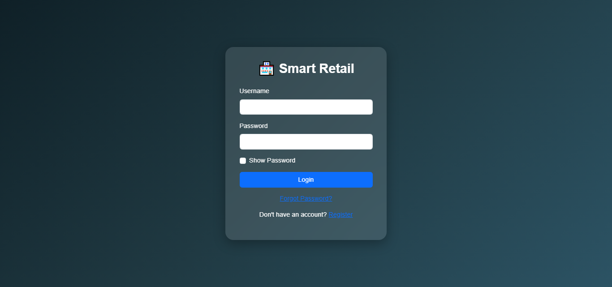
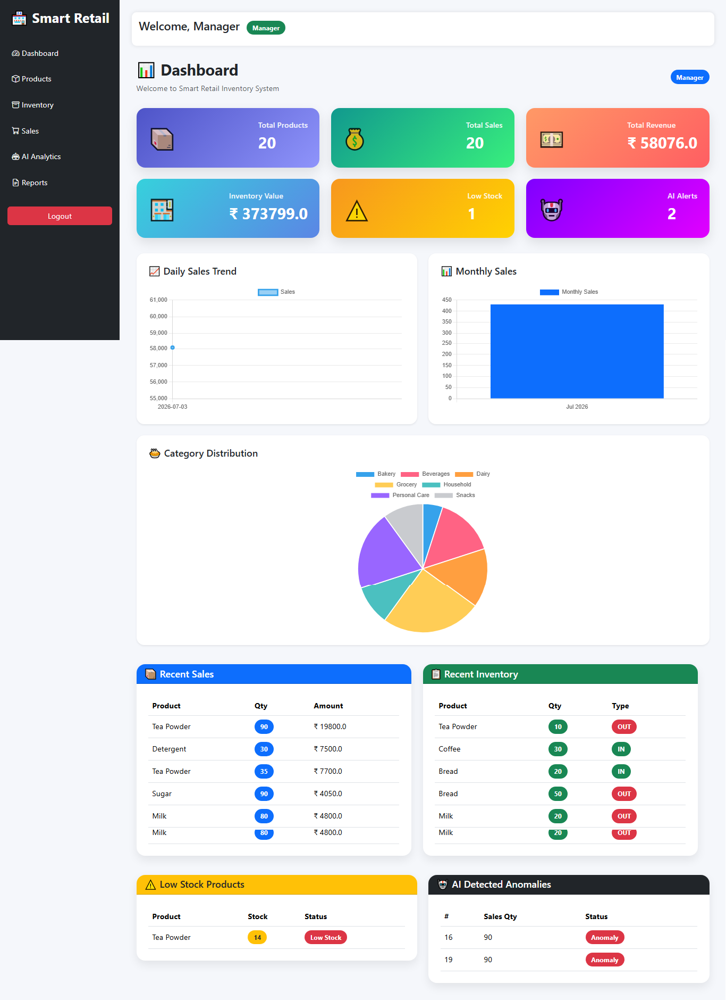
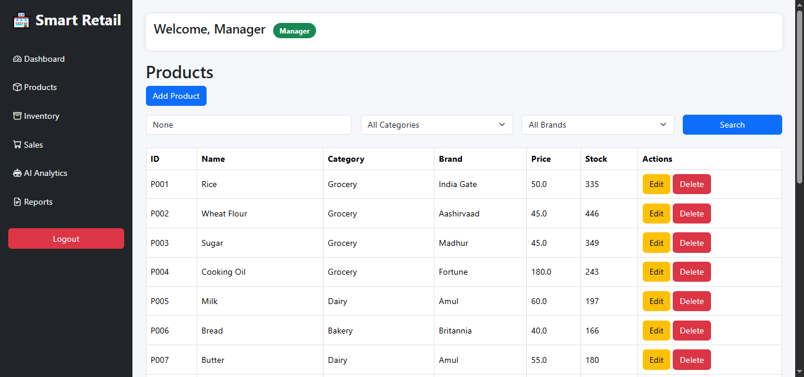
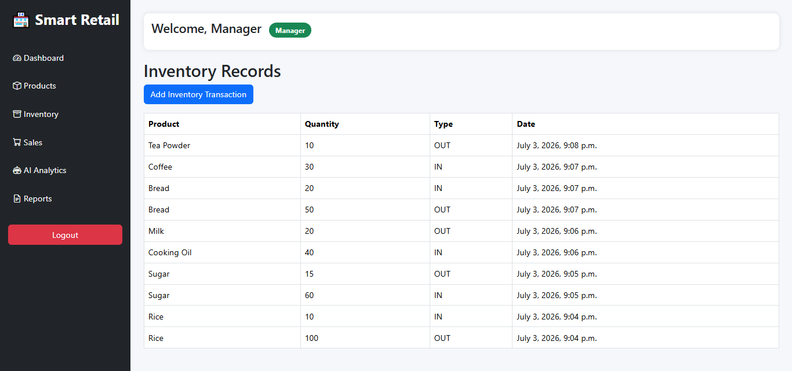
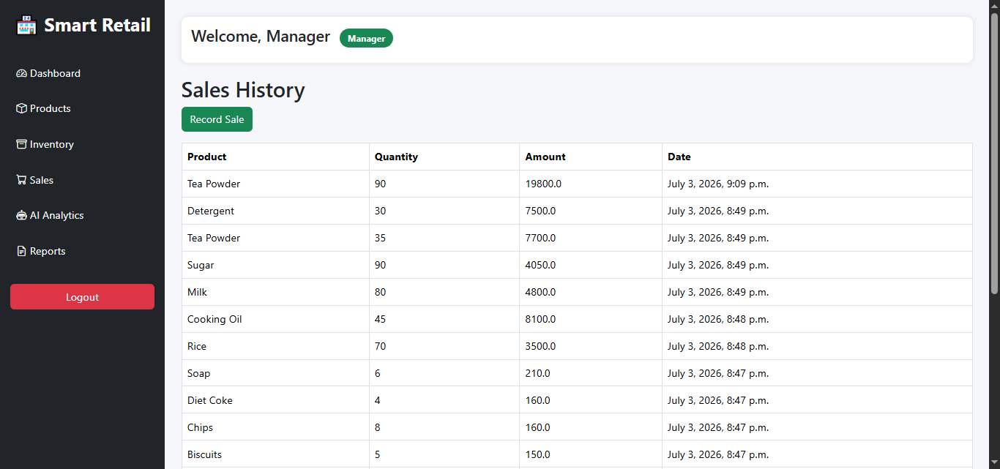
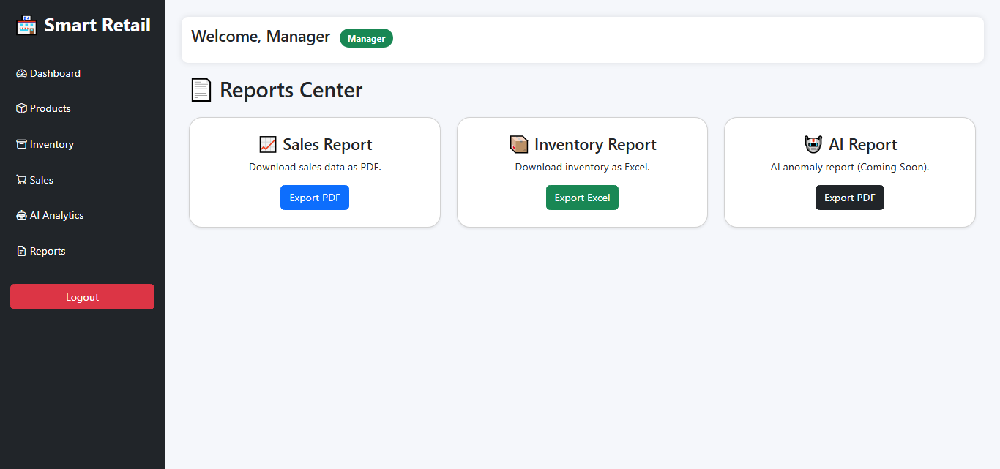
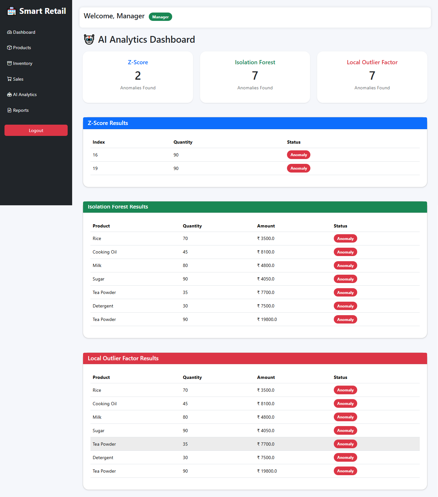

# 🏪 Smart Retail Inventory Management System with AI/ML

A full-stack **Django-based Smart Retail Inventory Management System** integrated with **Machine Learning** for anomaly detection. The system helps retailers manage products, inventory, sales, reports, authentication, and AI-powered analytics.

---

# 📌 Features

## 👤 Authentication
- User Login
- User Registration
- Forgot Password
- Password Reset via Email
- Logout
- Role-Based Access Control (Admin, Manager, Staff)

---

## 📦 Product Management
- Add Products
- Update Products
- Delete Products
- Product Listing
- Product Search

---

## 📊 Inventory Management
- Stock In
- Stock Out
- Inventory Records
- Low Stock Detection

---

## 💰 Sales Management
- Record Sales
- Sales History
- Revenue Calculation
- Sales Analytics

---

## 📑 Reports
- Sales Report (PDF)
- Inventory Report (Excel)
- AI Anomaly Report (PDF)

---

## 🤖 AI Analytics

Three anomaly detection techniques are implemented.

### Method 1 – Z-Score
Statistical anomaly detection based on standard deviation.

### Method 2 – Isolation Forest
Machine Learning model trained using historical retail sales data.

### Method 3 – Local Outlier Factor (LOF)
Density-based anomaly detection algorithm.

---

## 🔒 Role Based Access

### Admin
- Full Access

### Manager
- Products
- Inventory
- Sales
- Reports
- AI Analytics

### Staff
- Products
- Inventory
- Sales

Staff users cannot access:
- Reports
- AI Analytics

---

# 🧠 Machine Learning Workflow

```
Training Dataset
        │
        ▼
Data Preprocessing
        │
        ▼
StandardScaler
        │
        ▼
Isolation Forest
        │
        ▼
Local Outlier Factor
        │
        ▼
Save Trained Models (.pkl)
──────────────────────────────────
        │
        ▼
Django Application
        │
        ▼
Load Trained Models
        │
        ▼
Predict Anomalies
```

---

# 🏗️ Project Structure

```
SmartRetailInventory/

│
├── accounts/
├── analytics_dashboard/
├── api/
├── inventory/
├── products/
├── reports/
├── sales/
│
├── ai_engine/
│   ├── data/
│   ├── models/
│   ├── train_model.py
│   ├── predict.py
│   ├── predict_lof.py
│   ├── database_detector.py
│   ├── database_isolation.py
│   ├── database_lof.py
│   └── anomaly_detector.py
│
├── static/
├── templates/
├── manage.py
└── requirements.txt
```

---

# ⚙️ Technologies Used

## Backend
- Python
- Django
- Django REST Framework

## Frontend
- HTML5
- CSS3
- Bootstrap 5
- JavaScript
- Chart.js

## Database
- SQLite3

## Machine Learning
- Scikit-learn
- Isolation Forest
- Local Outlier Factor
- Z-Score
- StandardScaler
- Joblib
- Pandas
- NumPy

## Reporting
- ReportLab
- OpenPyXL

---

# 🚀 Installation

## Clone Repository

```bash
git clone https://github.com/YOUR_USERNAME/SmartRetailInventory.git

cd SmartRetailInventory
```

---

## Create Virtual Environment

### Windows

```bash
python -m venv myenv

myenv\Scripts\activate
```

### Linux / macOS

```bash
python3 -m venv myenv

source myenv/bin/activate
```

---

## Install Dependencies

```bash
pip install -r requirements.txt
```

---

## Apply Migrations

```bash
python manage.py makemigrations

python manage.py migrate
```

---

## Create Superuser

```bash
python manage.py createsuperuser
```

---

## Train Machine Learning Models

```bash
python ai_engine/train_model.py
```

This creates:

```
ai_engine/models/

isolation_forest.pkl

lof.pkl

scaler.pkl
```

---

## Run Server

```bash
python manage.py runserver
```

Open

```
http://127.0.0.1:8000/
```

---

# 📡 REST API

Example APIs

```
GET /api/products/

GET /api/inventory/

GET /api/sales/
```

---

# 📸 Screenshots

## Login Page



---

## Dashboard



---

## Products



---

## Inventory


---

## Sales



---

## Reports



---

## AI Analytics

> Add screenshot here




---

# 📊 Machine Learning Models

| Algorithm | Purpose |
|------------|----------|
| Z-Score | Statistical anomaly detection |
| Isolation Forest | Machine Learning anomaly detection |
| Local Outlier Factor | Density-based anomaly detection |

---

# 🎯 Future Enhancements

- Email Notifications
- Barcode Scanner
- QR Code Support
- Demand Forecasting
- Sales Prediction
- Deep Learning Models
- Cloud Deployment
- PostgreSQL Support

---

# 👨‍💻 Developer

**Anamika Kumari**
**Shekhar Kumar Ray**
**Ashwini Kumar Sinku**

Computer Science Engineering Student

AI | Machine Learning | Full Stack Django Developer

---

# ⭐ If you like this project

Please consider giving it a ⭐ on GitHub.
